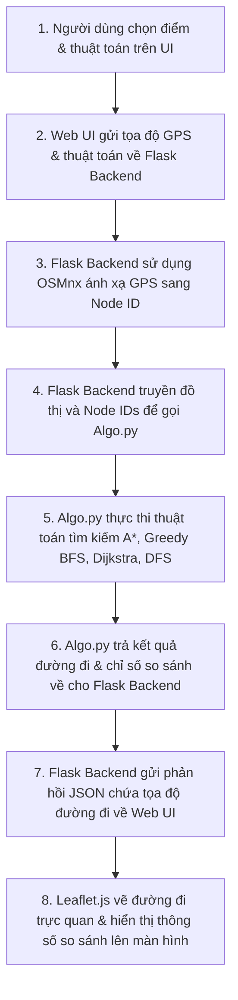
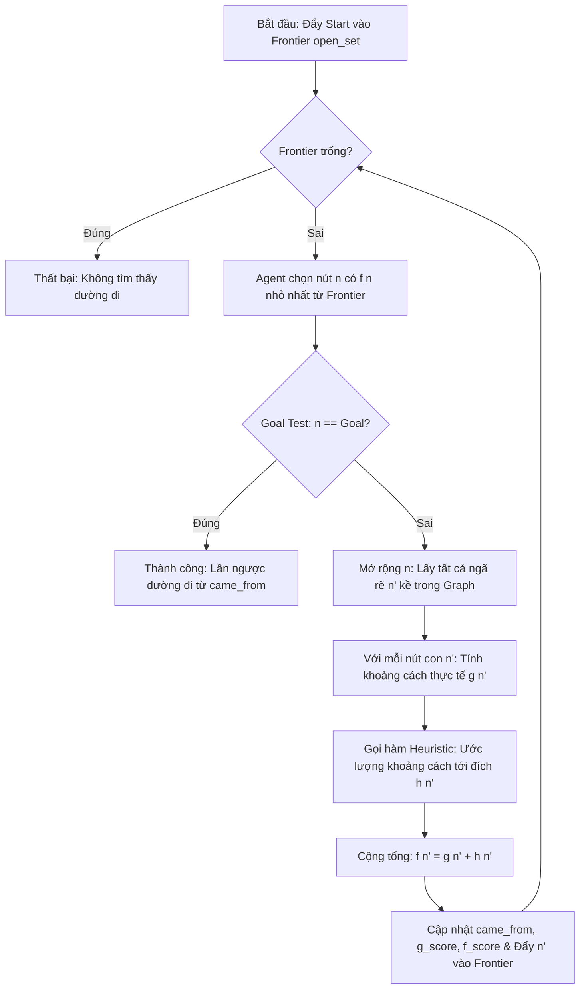

# BÁO CÁO CHI TIẾT DỰ ÁN: TÌM ĐƯỜNG ĐI TRÊN BẢN ĐỒ THỰC TẾ HÀ NỘI

Dự án này là một ứng dụng Web tương tác được thiết kế nhằm mô phỏng, trực quan hóa và so sánh các thuật toán tìm kiếm đường đi trong môn học **Nhập môn Trí tuệ Nhân tạo (Intro to Artificial Intelligence)**. Bằng việc tích hợp dữ liệu bản đồ thực tế từ **OpenStreetMap (OSM)** thông qua các thư viện Python chuyên dụng (`OSMnx`, `NetworkX`) ở Backend và thư viện bản đồ `Leaflet.js` ở Frontend, dự án đã xây dựng một môi trường trực quan hóa sinh động để kiểm nghiệm sức mạnh của các thuật toán AI.

---

## 1. Tổng Quan Kiến Trúc Hệ Thống

Hệ thống được thiết kế theo mô hình Client-Server tinh gọn. Luồng dữ liệu và sự tương tác giữa các thành phần được thể hiện trực quan qua sơ đồ tuần tự (Sequence Diagram) dưới đây:



### Các thành phần chính trong mã nguồn:
*   **[Deploy.py](file:///d:/20252/Intro%20AI/Project%20GK/Finding-path-and-street-map/Deploy.py)**: Đóng vai trò là Web Server xây dựng trên Flask. Tệp này chịu trách nhiệm:
    *   Tải bản đồ mạng lưới giao thông của Hà Nội từ tệp `noithanh_HaNoi.graphml` vào bộ nhớ lúc khởi động ứng dụng.
    *   Cung cấp API Endpoint (ví dụ: `/find_shortest_path`) tiếp nhận yêu cầu tọa độ từ client, gọi các hàm thuật toán xử lý và trả về kết quả định dạng JSON.
    *   Sử dụng thư viện `OSMnx` để ánh xạ tọa độ GPS do người dùng click chọn trên bản đồ về ID của đỉnh (Node ID) gần nhất trên đồ thị đường đi.
*   **[Algo.py](file:///d:/20252/Intro%20AI/Project%20GK/Finding-path-and-street-map/Algo.py)**: Chứa toàn bộ logic cài đặt cốt lõi của các thuật toán tìm kiếm (`A_star`, `Greedy_best_first_search`, `UCS`/`Dijkstra`, `DFS_search`), hàm phục hồi đường đi và hàm ước lượng Heuristic. Đây chính là hạt nhân thể hiện khía cạnh **Trí tuệ nhân tạo** của đồ án.
*   **[templates/index.html](file:///d:/20252/Intro%20AI/Project%20GK/Finding-path-and-street-map/templates/index.html)**: Giao diện Web tương tác phía Client. Sử dụng thư viện **Leaflet.js** để hiển thị bản đồ nền, cho phép người dùng click trực quan để chọn điểm đầu/cuối, chọn thuật toán và hiển thị các chỉ số so sánh (thời gian thực thi, số nút đã duyệt, tổng khoảng cách).
*   **`noithanh_HaNoi.graphml`**: Cơ sở dữ liệu lưu trữ cấu trúc đồ thị mạng lưới đường giao thông các quận nội thành Hà Nội. Đồ thị chứa các đỉnh (nút giao thông, ngã ba, ngã tư) và các cạnh (các đoạn đường) đi kèm các thuộc tính thực tế như chiều dài đường (`length`), kinh/vĩ độ, đường một chiều (`oneway`), v.v.

---

## 2. Mô Hình Hóa Bài Toán Dưới Góc Nhìn Trí Tuệ Nhân Tạo (AI)

Trong dự án này, bài toán tìm đường thực tế được mô hình hóa theo các khái niệm chuẩn của Trí tuệ Nhân tạo về **Tìm kiếm Không gian Trạng thái (State Space Search)** và **Tác tử Tìm kiếm (Search Agent)**.

### A. Định nghĩa Không gian Trạng thái
Để máy tính hiểu và giải quyết được bài toán, mạng lưới giao thông thực tế được trừu tượng hóa thành các thành phần toán học sau:
1.  **Trạng thái (State)**: Vị trí hiện tại của tác tử trên bản đồ, được xác định duy nhất bằng một Đỉnh (Node ID) trên đồ thị đường đi.
2.  **Trạng thái khởi đầu (Initial State)**: Đỉnh xuất phát N_start, tương ứng với điểm đi do người dùng chọn.
3.  **Trạng thái đích (Goal State)**: Đỉnh đích N_goal, tương ứng với điểm đến mong muốn.
4.  **Hành động (Actions)**: Việc di chuyển từ đỉnh hiện tại sang một trong các đỉnh lân cận liên kết trực tiếp.
5.  **Chi phí bước đi (Step Cost)**: Chi phí di chuyển giữa hai đỉnh kề nhau, ở đây là độ dài thực tế của đoạn đường (cạnh nối) tính bằng mét (`length`).
6.  **Chi phí tích lũy (Path Cost - g(n))**: Tổng độ dài thực tế của chặng đường di chuyển từ trạng thái khởi đầu đến trạng thái hiện tại n.

### B. Chu trình hoạt động của Tác tử Tìm kiếm (Search Agent Loop)
Tác tử tìm đường hoạt động theo mô hình **Cảm nhận - Lập luận - Hành động (Perception-Reasoning-Action Loop)**:
*   **Cảm nhận (Perception)**: Tác tử tiếp nhận dữ liệu đầu vào bao gồm mạng lưới đồ thị liên kết và tọa độ địa lý của điểm khởi hành, điểm kết thúc.
*   **Lập luận (Reasoning)**: Dựa trên các thuật toán tìm kiếm có thông tin hoặc không có thông tin, kết hợp với tri thức địa lý từ hàm Heuristic h(n) để phân tích, tính toán giá trị đánh giá các ngả đường tiềm năng tại mỗi ngã rẽ.
*   **Hành động (Action)**: Ra quyết định chọn mở rộng nút tối ưu tiếp theo từ hàng đợi, lặp lại cho đến khi tìm thấy đích và trả về chuỗi đường đi ngắn nhất.

---

## 3. Thiết Kế Tri Thức AI: Hàm Ước Lượng Heuristic (h(n))

Bản thân máy tính hoặc mạng lưới đồ thị thô ban đầu không hề có ý niệm về hướng đi hay khoảng cách địa lý còn lại để tới đích. Nếu tìm kiếm "mù quáng" (không có thông tin dẫn hướng), thuật toán sẽ phải thử nghiệm lan tỏa đều theo mọi hướng xung quanh điểm xuất phát, dẫn đến việc duyệt qua hàng ngàn trạng thái dư thừa không cần thiết.

Hàm Heuristic h(n) chính là **"tri thức thực tế của con người"** được lập trình hóa vào máy tính để đóng vai trò như một chiếc la bàn định vị phương hướng.

### A. Công thức Toán học áp dụng
Trong dự án này, hàm Heuristic h(n) được định nghĩa tại hàm `h1` trong file [Algo.py](file:///d:/20252/Intro%20AI/Project%20GK/Finding-path-and-street-map/Algo.py#L59-L77). Hàm ước lượng khoảng cách dựa trên phương pháp **Chiếu khoảng cách phẳng (Equirectangular Projection)** nhằm quy đổi tọa độ GPS (Kinh độ/Vĩ độ tính bằng độ) sang khoảng cách thực tế (mét) trên mặt phẳng phẳng cục bộ của Hà Nội:

```text
lat_mean = ((lat1 + lat2) / 2) * (pi / 180)
dx = (lon2 - lon1) * 111320 * cos(lat_mean)
dy = (lat2 - lat1) * 111320
h(n) = sqrt(dx^2 + dy^2)
```

#### Giải thích chi tiết các thông số trong công thức:
*   **Hằng số 111,320 mét**: Chu vi Trái Đất quanh Xích đạo khoảng 40,075,000 mét. Vì một vòng tròn Trái Đất có 360 độ, nên độ dài thực tế tương ứng với 1 độ chênh lệch kinh độ/vĩ độ tại xích đạo xấp xỉ bằng:
    `40,075,000m / 360 độ ≈ 111,320m (khoảng 111.3 km)`
*   **Khoảng cách dọc dy (Vĩ độ - Bắc/Nam)**: Các đường vĩ tuyến là các đường tròn song song đồng tâm, khoảng cách thực tế giữa các đường vĩ tuyến cách nhau 1 độ luôn không đổi trên toàn cầu (xấp xỉ 111,320 mét). Do đó, khoảng cách thực tế theo trục dọc (dy) bằng chênh lệch vĩ độ nhân trực tiếp với hằng số 111,320:
    `dy = (lat2 - lat1) * 111,320`
*   **Khoảng cách ngang dx (Kinh độ - Đông/Tây)**: Các đường kinh tuyến đồng quy tại hai cực địa lý. Do đó, khoảng cách thực tế giữa 2 đường kinh tuyến cách nhau 1 độ sẽ **thu hẹp dần** từ Xích đạo về phía hai cực theo hàm lượng giác cos của vĩ độ:
    *   Để tính toán chính xác cho khu vực di chuyển giữa hai điểm, ta lấy vĩ độ trung bình: `lat_mean = (lat1 + lat2) / 2`.
    *   Do hàm lượng giác `cos` trong Python nhận đầu vào là đơn vị radian, vĩ độ trung bình cần được nhân với `pi / 180` để chuyển đổi từ đơn vị **độ (degrees)** sang **radian**.
    *   Từ đó, khoảng cách chênh lệch thực tế theo trục ngang (dx) là:
        `dx = (lon2 - lon1) * 111320 * cos(lat_mean)`
*   **Khoảng cách tổng hợp h(n)**: Áp dụng định lý Pythagoras trên hệ tọa độ phẳng cục bộ:
    `h(n) = sqrt(dx^2 + dy^2)`
    Công thức chiếu phẳng này có tốc độ tính toán cực kỳ nhanh (chỉ chứa một hàm lượng giác cos đơn giản và các phép toán cơ bản) so với công thức Haversine đầy đủ vốn yêu cầu nhiều phép toán sin, arcsin phức tạp. Điều này giúp giảm thiểu tải tính toán cho CPU khi chạy thuật toán tìm đường trên đồ thị lớn lên tới hàng triệu lần lặp.

### B. Thuộc tính lý thuyết của Heuristic
Để thuật toán tìm kiếm thông minh vận hành tối ưu, hàm Heuristic được thiết kế đảm bảo hai thuộc tính toán học quan trọng của AI:
1.  **Tính chấp nhận được (Admissible Heuristic)**: Heuristic h(n) được gọi là chấp nhận được nếu nó không bao giờ đánh giá cao hơn chi phí thực tế tối ưu h*(n) để đi từ n đến đích (nghĩa là h(n) <= h*(n)). Vì đường chim bay luôn là đường ngắn nhất nối giữa hai điểm địa lý, nên khoảng cách đường chim bay chắc chắn sẽ luôn nhỏ hơn hoặc bằng quãng đường di chuyển thực tế qua mạng lưới giao thông đường bộ vốn quanh co khúc khuỷu. Do đó, h(n) ở đây hoàn toàn **Admissible**.
2.  **Tính nhất quán (Consistent / Monotonic Heuristic)**: Heuristic thỏa mãn tính nhất quán nếu với mọi nút n và nút con n' của nó (được sinh ra bởi hành động a có chi phí bước đi c(n, a, n')), ta luôn có bất đẳng thức tam giác:
    `h(n) <= c(n, a, n') + h(n')`
    Khoảng cách đường chim bay tuân thủ bất đẳng thức tam giác địa lý, do đó nó hoàn toàn thỏa mãn tính chất nhất quán.

> [!IMPORTANT]
> Nhờ có hàm Heuristic vừa **chấp nhận được (Admissible)** vừa **nhất quán (Consistent)**, thuật toán **A\*** được đảm bảo chắc chắn sẽ tìm ra **đường đi ngắn nhất tối ưu** mà không cần phải duyệt lại các nút đã đóng trong quá trình tìm kiếm.

---

## 4. Phân Tích Các Thuật Toán Tìm Kiếm Đường Đi

Mã nguồn [Algo.py](file:///d:/20252/Intro%20AI/Project%20GK/Finding-path-and-street-map/Algo.py) triển khai 4 thuật toán đại diện cho cả 2 nhóm chính trong AI: **Tìm kiếm Không có Thông tin (Uninformed Search)** và **Tìm kiếm Có Thông tin (Informed Search)**.

### A. Phân loại tư duy tìm kiếm trong AI

#### 1. Tìm kiếm Không có Thông tin (Uninformed Search / Blind Search)
*   **Khái niệm**: Thuật toán chỉ dựa trên cấu trúc kết nối của bài toán (trạng thái kề) để duyệt mà không có thêm bất kỳ thông tin gợi ý nào về việc một nút trung gian có "gần" đích hơn nút khác hay không. Thuật toán hoàn toàn "mù hướng" về vị trí của đích.
*   **Hình ảnh ẩn dụ**: Giống như bị bịt mắt đứng trong mê cung và sờ soạng lần mò từng ngõ ngách, thử mọi con đường khả thi theo một trật tự máy móc mà không có la bàn định hướng.
*   **Các thuật toán cài đặt**: DFS (Duyệt theo chiều sâu), Dijkstra / UCS (Duyệt theo chi phí tối thiểu).

#### 2. Tìm kiếm Có Thông tin (Informed Search / Heuristic Search)
*   **Khái niệm**: Thuật toán sử dụng thêm thông tin bổ trợ (tri thức thực tế) dưới dạng hàm Heuristic h(n) để đánh giá mức độ hứa hẹn của các trạng thái. Từ đó, thuật toán ưu tiên duyệt những con đường có xu hướng tiến lại gần đích trước.
*   **Hình ảnh ẩn dụ**: Giống như đi trong mê cung nhưng cầm trên tay một chiếc la bàn chỉ hướng của lối ra. Ta sẽ luôn ưu tiên rẽ vào các ngõ hướng về phía la bàn chỉ, tiết kiệm tối đa thời gian mò mẫm ở các hướng ngược lại.
*   **Các thuật toán cài đặt**: Greedy BFS, A*.

---

### B. Bảng So Sánh Tổng Hợp Hiệu Năng Các Thuật Toán

| Thuật Toán | Loại Tìm Kiếm | Hàm Đánh Giá f(n) | Tính Tối Ưu (Ngắn Nhất) | Số Nút Duyệt | Đặc Điểm & Hành Vi Thực Tế |
| :--- | :--- | :--- | :--- | :--- | :--- |
| **DFS** | Uninformed | Không có | **Không** | Rất biến động | Đi sâu nhất có thể trước khi quay lui. Đường đi tìm được thường ngoằn ngoèo, dài bất hợp lý và không có giá trị thực tiễn. |
| **Dijkstra / UCS** | Uninformed | f(n) = g(n) | **Có** | Lớn nhất | Chỉ quan tâm đến quãng đường đã đi qua g(n). Lan tỏa đều ra xung quanh như một làn sóng tròn cho đến khi chạm tới đích, duyệt nhiều nút dư thừa ở hướng ngược đích. |
| **Greedy BFS** | Informed | f(n) = h(n) | **Không** | Nhỏ nhất | Chỉ quan tâm đến khoảng cách ước lượng tới đích h(n). Đi rất nhanh về phía đích nhưng dễ bị đi đường vòng hoặc mắc kẹt tạm thời nếu gặp chướng ngại vật lớn. |
| **A\*** | Informed | f(n) = g(n) + h(n) | **Có** | Trung bình | Kết hợp cả chi phí đã qua g(n) và dự báo Heuristic h(n). Hướng luồng tìm kiếm trực diện về phía đích nhưng vẫn đảm bảo tính tối ưu của đường đi. |
| **Bidirectional A\*** | Informed | f_start(n), f_goal(n) | **Có** | Rất ít | Tìm kiếm đồng thời từ 2 phía (Start và Goal). Thu hẹp vùng không gian tìm kiếm cực kỳ hiệu quả, cho tốc độ xử lý nhanh vượt trội khi tìm đường dài. |

---

### C. Chi tiết cơ chế hoạt động của từng thuật toán

#### A. Thuật toán A* (A-Star Search)
*   **Cơ chế hoạt động**: Quản lý tập các nút đang chờ duyệt (`open_set`) bằng hàng đợi ưu tiên (Priority Queue / Min-Heap). Tại mỗi bước lặp, thuật toán lấy ra nút n có giá trị đánh giá `f(n) = g(n) + h(n)` nhỏ nhất để mở rộng.
*   **Vai trò**: Đây là thuật toán trung tâm của dự án. Nhờ sự kết hợp cân bằng giữa chi phí thực tế đã đi qua g(n) và khoảng cách ước lượng đến đích h(n), A* tìm được đường đi ngắn nhất chính xác tuyệt đối mà chỉ cần duyệt qua một lượng nút tối thiểu.

#### B. Thuật toán Greedy Best-First Search (Greedy BFS)
*   **Cơ chế hoạt động**: Sắp xếp hàng đợi ưu tiên hoàn toàn dựa trên giá trị `f(n) = h(n)` (khoảng cách chim bay tới đích).
*   **Hành vi thực tế**: Thuật toán di chuyển cực kỳ nhanh về phía đích vì nó luôn chọn hướng đi thẳng tiến tới đích nhất ở mỗi ngã rẽ. Tuy nhiên, do hoàn toàn bỏ qua chi phí thực tế đã đi qua g(n), thuật toán này dễ bị lừa chọn các con đường ngõ cụt hoặc đường vòng rất xa nếu giữa điểm bắt đầu và kết thúc có chướng ngại vật lớn (như hồ nước lớn hoặc dải phân cách giao thông).

#### C. Thuật toán Dijkstra / UCS (Uniform Cost Search)
*   **Cơ chế hoạt động**: Sắp xếp hàng đợi ưu tiên dựa trên chi phí đường đi thực tế tích lũy `f(n) = g(n)`.
*   **So sánh với A\***: Dijkstra chính là phiên bản đặc biệt của A* khi ta coi hàm Heuristic `h(n) = 0` với mọi nút. Do không có la bàn định hướng của Heuristic, Dijkstra buộc phải mở rộng đều ra mọi ngả đường (lan tỏa tròn như sóng nước). Số lượng đỉnh phải duyệt qua (`nodes_expanded`) thường lớn gấp nhiều lần so với A*, gây tốn tài nguyên hệ thống.

#### D. Thuật toán DFS (Depth-First Search)
*   **Cơ chế hoạt động**: Sử dụng cấu trúc ngăn xếp (Stack - LIFO) để duyệt sâu nhất có thể trước khi quay lui.
*   **Hành vi thực tế**: Duyệt mù hoàn toàn, đi theo một nhánh đến khi gặp ngõ cụt mới quay lại thử nhánh khác. Do không quan tâm tới chiều dài đường đi hay khoảng cách địa lý, kết quả đường đi của DFS thường cực kỳ dài, vòng vèo và không có tính ứng dụng thực tế. Nó được đưa vào nhằm làm nổi bật tính ưu việt của các thuật toán AI.

#### E. Thuật toán Bidirectional A* (A-Star Hai Chiều)
*   **Cơ chế hoạt động**: Chạy tìm kiếm song song từ Start hướng tới Goal (xuôi) và từ Goal hướng ngược về Start (ngược). Hướng ngược sử dụng cấu trúc đồ thị đảo chiều (Reverse Graph) để đi đúng luật đường một chiều. 
*   **Hành vi thực tế**: Tiết kiệm đáng kể số nút phải duyệt. Bằng cách chia đôi bài toán tìm kiếm thành 2 vòng tròn nhỏ loang vào nhau, Bidirectional A* giảm độ phức tạp thời gian từ mũ b^d xuống còn b^(d/2), vô cùng tối ưu cho các bài toán bản đồ khoảng cách xa.

---

## 5. Quy Trình Xử Lý Dữ Liệu Bản Đồ Thực Tế

Để các thuật toán AI có thể vận hành trên bản đồ thực tế của Hà Nội, dữ liệu đồ thị phải đi qua quy trình xử lý 3 bước nghiêm ngặt:

1.  **Trích xuất mạng lưới đường đi**: Thư viện `OSMnx` tải dữ liệu giao thông từ hệ thống GIS của OpenStreetMap, chuyển đổi các ngã rẽ thành các Đỉnh (Nodes) có thuộc tính tọa độ `x` (kinh độ), `y` (vĩ độ); các con đường nối giữa chúng được chuyển thành các Cạnh (Edges) có thuộc tính độ dài thực tế `length` (mét).
2.  **Đơn giản hóa đồ thị (`Create_simple_Graph`)**: Đồ thị gốc từ OSMnx chứa rất nhiều thông tin phụ không cần thiết cho tính toán tìm đường. Hàm `Create_simple_Graph` trong [Algo.py](file:///d:/20252/Intro%20AI/Project%20GK/Finding-path-and-street-map/Algo.py#L43-L57) lọc và chuyển đổi đồ thị này sang cấu trúc danh sách kề (Adjacency List) thuần Python dưới dạng `dict`:
    ```python
    Graph = {
        node_id_1: [[neighbor_id_A, length_1A], [neighbor_id_B, length_1B]],
        node_id_2: ...
    }
    ```
    Việc chuyển đổi sang cấu trúc dữ liệu cơ bản này giúp giảm thiểu tối đa độ phức tạp khi truy xuất dữ liệu trong vòng lặp chính của các thuật toán tìm kiếm, đẩy tốc độ chạy thuật toán lên tối đa.
3.  **Chiếu tọa độ điểm click**: Khi người dùng click chọn điểm khởi hành A và điểm đến B trên bản đồ Leaflet.js, tọa độ GPS [lat, lon] được gửi về Flask. Flask gọi hàm `ox.distance.nearest_nodes` để tìm đỉnh thực tế trên đồ thị gần với vị trí click nhất, biến bài toán click chuột tự do thành bài toán tìm kiếm đường đi giữa 2 đỉnh cụ thể trên đồ thị.

---

## 6. Kịch Bản Minh Họa Và Quy Trình Lập Luận Từng Bước Của AI

Để hiểu rõ hàm Heuristic được chạy như thế nào và tác động trực tiếp ra sao đến quyết định của tác tử tìm đường, hãy xem một kịch bản tìm đường cụ thể từ **Hồ Hoàn Kiếm** đến **Nhà hát Lớn Hà Nội**:

### A. Kịch bản chạy thực tế
*   **Bước 1**: Người dùng chọn điểm xuất phát tại Hồ Hoàn Kiếm (GPS: 21.0285, 105.8521) và đích đến tại Nhà hát Lớn (GPS: 21.0244, 105.8574). Giao diện gửi payload API về Backend:
    ```json
    {"start": [21.0285, 105.8521], "end": [21.0244, 105.8574], "algorithm": "A Star"}
    ```
*   **Bước 2**: Flask ánh xạ tọa độ GPS về các Node ID giao thông thực tế:
    *   Điểm xuất phát A -> Đỉnh đồ thị N_start (ID: 307481912, ngã tư Đinh Tiên Hoàng - Tràng Tiền).
    *   Điểm đích B -> Đỉnh đồ thị N_goal (ID: 534571991, vòng xuyến Nhà hát Lớn).
*   **Bước 3**: Thuật toán A* khởi chạy.
    *   Khởi tạo hàng đợi ưu tiên `open_set`.
    *   Tính toán chi phí cho điểm xuất phát: `g(start) = 0`.
    *   Gọi hàm Heuristic `h1` tính khoảng cách chim bay từ Hồ Hoàn Kiếm đến Nhà hát Lớn: `h(start) ≈ 715 mét`.
    *   Đánh giá tổng: `f(start) = g(start) + h(start) = 0 + 715 = 715`.
    *   Đẩy nút vào hàng đợi: `open_set = [(715, 307481912)]`.

### B. Quy trình Lập luận Ra quyết định (Reasoning) tại ngã rẽ
Thuật toán lấy nút có giá trị f nhỏ nhất ra khỏi hàng đợi (đó là nút gốc N_start) để mở rộng các hướng rẽ tiếp theo:

1.  **Nhánh 1: Rẽ vào phố Tràng Tiền (Hướng về phía Nhà hát Lớn)**
    *   Đến ngã rẽ tiếp theo N_TrangTien cách nút xuất phát quãng đường thực tế là 150m.
    *   Chi phí thực tế đã đi: `g(N_TrangTien) = g(N_start) + 150 = 150m`.
    *   Ước lượng khoảng cách chim bay đến Nhà hát Lớn: `h(N_TrangTien) ≈ 580m` (khoảng cách giảm vì nút này nằm gần đích hơn).
    *   Tính tổng đánh giá:
        `f(N_TrangTien) = g(N_TrangTien) + h(N_TrangTien) = 150 + 580 = 730`
    *   Đẩy nút N_TrangTien vào `open_set` với giá trị ưu tiên 730.

2.  **Nhánh 2: Đi ngược về bờ hồ dọc phố Lê Thái Tổ (Hướng đi xa đích)**
    *   Đến ngã rẽ tiếp theo N_LeThaiTo cách nút xuất phát quãng đường thực tế là 200m.
    *   Chi phí thực tế đã đi: `g(N_LeThaiTo) = g(N_start) + 200 = 200m`.
    *   Ước lượng khoảng cách chim bay đến Nhà hát Lớn: `h(N_LeThaiTo) ≈ 900m` (khoảng cách tăng vì đi xa đích hơn).
    *   Tính tổng đánh giá:
        `f(N_LeThaiTo) = g(N_LeThaiTo) + h(N_LeThaiTo) = 200 + 900 = 1100`
    *   Đẩy nút N_LeThaiTo vào `open_set` với giá trị ưu tiên 1100.

*   **Quyết định của Tác tử**:
    Trong bước lặp tiếp theo, thuật toán so sánh các phần tử trong hàng đợi ưu tiên. Vì `f(N_TrangTien) = 730` nhỏ hơn nhiều so với `f(N_LeThaiTo) = 1100`, tác tử quyết định **chọn mở rộng từ nút N_TrangTien trước**. Nhánh đi ngược chiều Lê Thái Tổ bị xếp lại phía sau. Tri thức Heuristic địa lý đã định hướng thành công để ngăn thuật toán đi chệch hướng.
*   **Bước 5**: Khi lấy ra được đỉnh đích N_goal khỏi hàng đợi ưu tiên, tác tử sử dụng bảng băm `came_from` để truy vết ngược lại danh sách các ID đỉnh đã đi qua và chuyển đổi thành chuỗi tọa độ GPS.
*   **Bước 6**: Flask trả chuỗi tọa độ về phía Client. Thư viện Leaflet.js vẽ trực quan hóa đường đi màu xanh dương uốn lượn chính xác theo các con phố lên màn hình người dùng.

---

### C. Sơ đồ Chu trình Suy diễn của Tác tử (AI Agent Reasoning Loop)

Dưới đây là sơ đồ chi tiết mô tả thuật toán lựa chọn và ra quyết định trong vòng lặp chính của Tác tử Tìm kiếm:



---

## 7. Kết Luận & Đánh Giá Hiệu Năng Thực Tế

Dự án đã chứng minh một cách sinh động sức mạnh của việc kết hợp **Trí tuệ nhân tạo (AI)** với dữ liệu GIS thực tế để giải quyết các bài toán giao thông đô thị:

1.  **Sự đánh đổi về mặt hiệu năng**:
    *   **DFS (Duyệt sâu)**: Có tốc độ tìm kiếm nhanh chóng khi tìm thấy lời giải đầu tiên, nhưng chất lượng đường đi tệ hại nhất (hoàn toàn không tối ưu).
    *   **Dijkstra / UCS (Duyệt rộng)**: Đảm bảo tìm ra đường đi ngắn nhất tuyệt đối, nhưng vì tìm kiếm mù nên phải duyệt lượng nút khổng lồ, gây trễ hiệu năng trên các đồ thị lớn.
    *   **Greedy BFS (Tham lam)**: Số lượng nút duyệt nhỏ nhất, tốc độ phản hồi nhanh nhất nhưng đường đi dễ bị đi vòng hoặc không tối ưu.
    *   **A\*** (Tối ưu): Là sự kết hợp hoàn hảo. A* mang lại đường đi ngắn nhất chính xác tuyệt đối như Dijkstra nhưng với thời gian xử lý cực kỳ nhanh và số lượng nút cần duyệt tối thiểu nhờ sự dẫn đường thông minh của hàm Heuristic.
2.  **Tầm quan trọng của thiết kế Heuristic**:
    *   Việc sử dụng công thức chiếu phẳng thu gọn mang lại hiệu suất vượt trội cho hàm Heuristic.
    *   Đảm bảo tính chất **Admissible** và **Consistent** là điều kiện tiên quyết để thuật toán A* đạt được tính tối ưu toàn cục.
